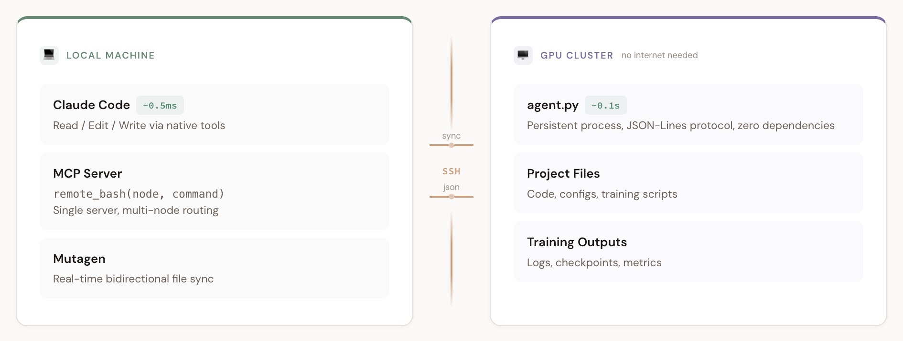

# Remote Cluster Agent


[English](README.md) | 中文

> 让 Coding Agent 在无公网的 GPU 集群上自动迭代。本地读写，远程执行，~0.1s 延迟。

## 安装

```bash
npx skills add jiahao-shao1/sjh-skills --skill remote-cluster-agent
```

安装后重启你的 agent，然后说"连集群"开始使用。Agent 会在首次使用时引导你完成配置（节点、路径、MCP server 安装）。

## v0.3.0 新特性

- **两层配置**：全局基础设施配置 + 项目级配置，存放在 `~/.config/remote-cluster-agent/`
- **自动部署 Agent**：启动时自动检测并部署集群端 Agent，无需手动操作
- **集群健康巡检**：并行扫描所有节点的 GPU/磁盘/tmux/负载状态，智能推荐最空闲节点
- **统一 MCP server**：单个 `cluster` MCP server，`node` 参数路由（替代原来的多个 per-node server）
- **one-way-replica 同步**：默认 Mutagen 模式，同步 `.git` 保持集群端 git status 干净，永不冲突
- **读文件优先本地**：智能提示优先读取 Mutagen 同步到本地的文件，而非通过 remote_bash
- **SSH config 自动生成**：自动生成 `~/.ssh/config` 条目，使用最佳实践配置

## 架构



> [交互版本](docs/architecture.html) — 点击切换 Agent 和 Sentinel 模式。

**两种执行模式**——Agent 模式快 ~10x，Sentinel 模式是自动回退：

| 模式 | 延迟 | 原理 |
|------|------|------|
| **Agent 模式** | ~0.1s | 持久 SSH 连接 → 集群端 `agent.py` → JSON-Lines 协议 |
| **Sentinel 模式** | ~1.5s | 逐命令 SSH → 哨兵模式检测 → `proc.kill()` |

```
本地机器                                  GPU 集群（不需要公网）
├── Claude Code / Codex (Read/Edit/Write)└── /path/to/project/
│   每次操作 ~0.5ms                          ├── 训练脚本
├── Mutagen 实时同步 ◄───SSH────────────► 代码 + 日志
├── remote_bash MCP ─────SSH────────────► bash 命令
│   Agent 模式: ~0.1s                       └── agent.py（持久运行）
│   Sentinel 回退: ~1.5s
└── 本地读取结果（快 ~20x）
```

### 自动化循环

```
修改代码（本地） → Mutagen 即时同步 → 跑实验（远程） → 日志同步回来 → 读结果（本地） → 循环
```

## 快速开始

### 1. 安装 skill

```bash
npx skills add jiahao-shao1/sjh-skills --skill remote-cluster-agent
```

### 2. 安装 MCP server

**多节点（推荐）**：
```bash
bash <skill_dir>/mcp-server/setup.sh '{"train":"ssh -p 2222 gpu-node","eval":"ssh gpu-eval"}' /home/user/project
```

**单节点兼容模式**：
```bash
bash <skill_dir>/mcp-server/setup.sh train "ssh -p 2222 gpu-node" /home/user/project
```

**指定客户端**：
```bash
bash <skill_dir>/mcp-server/setup.sh --client codex '{"train":"ssh -p 2222 gpu-node"}' /home/user/project
```

前置条件：[uv](https://docs.astral.sh/uv/)、SSH 可访问集群、已安装 Claude Code 或 Codex CLI。

### 3. 重启并自动部署

重启你的 agent。集群端 Agent 会在首次使用时自动检测并部署——无需手动操作。不部署 Agent 也能用，只是走 Sentinel 模式（~1.5s/命令）。

### 4. 配置 Mutagen 同步

```bash
bash <skill_dir>/mutagen-setup.sh gpu-node ~/repo/my_project /home/user/my_project
```

详见 [MUTAGEN.md](MUTAGEN.md)。完全通过 SSH 工作——集群不需要公网。

### 5. 首次交互式配置

首次使用时，agent 会问你几个问题（SSH 端点、路径、安全限制），自动在 `~/.config/remote-cluster-agent/` 生成配置。配置文件留在本地，不会提交到 git。

## 配置

两层配置位于 `~/.config/remote-cluster-agent/`：

| 文件 | 用途 |
|------|------|
| `context.local.md` | 全局：集群节点、共享存储、安全规则、GPU 脚本 |
| `<project>.md` | 项目级：代码路径、Mutagen 会话、输出同步 |

首次使用时通过交互式配置生成。

## 文件结构

```
remote-cluster-agent/
├── SKILL.md                          # Skill 指令
├── README.md                         # 英文说明
├── README.zh-CN.md                   # 本文件
├── MUTAGEN.md                        # Mutagen 同步指南
├── VERSION                           # 0.3.0
├── .gitignore
├── cluster-agent/
│   └── agent.py                      # 集群端 Agent（零依赖，~100 行）
├── mcp-server/
│   ├── mcp_remote_server.py          # MCP server（Agent + Sentinel 模式）
│   ├── pyproject.toml                # 依赖：mcp>=1.25
│   └── setup.sh                      # 一键安装（Claude Code / Codex）
├── mutagen-setup.sh                  # Mutagen 文件同步配置
├── reference/
│   ├── context.template.md           # 全局配置模板
│   ├── project.template.md           # 项目配置模板
│   └── cluster-health.md             # 巡检流程
└── docs/
    ├── architecture.png              # 架构图
    └── architecture.html             # 交互版本
```

## 致谢

深受 [claude-code-local-for-vscode](https://github.com/justimyhxu/claude-code-local-for-vscode) 项目启发。

感谢 [@cherubicXN](https://github.com/cherubicXN) 实现的基于 Mutagen 的本地-集群实时同步方案。

## 许可证

MIT
